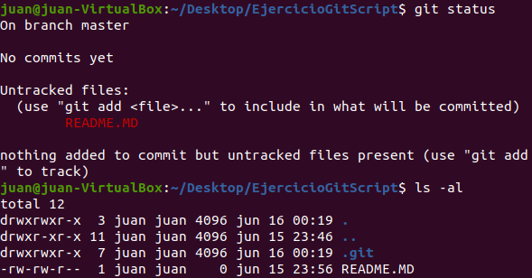

# EXAMEN DAW - JUAN VALLS

## Crear las carpetas y primeras instrucciones de Git
___

Lo primero que deberemos hacer es ir al directorio en el que queramos crear nuestra carpeta de trabajo.

En este caso el escritorio:

```
cd Desktop
```

Una vez ahí creamos una carpeta:

```
mkdir EjercicioGitScritp
```

Accedemos a ella:

```
cd EjercicioGitScript
```

Para iniciarlizar un repositorio local en esta carpeta deberemos introducir lo siguiente:

```
git init
```

Por consola nos dirá lo siguiente:

```
Initialized existing Git repository in /home/juan/Desktop/EjercicioGitScript/.git/
```

Vamos a presuponer que hemos creado después de hacer esto un archivo README.MD en esta carpeta, pero no lo hemos incluido en git.

Para ver que esto es así haremos lo siguiente:

```
git status
```

Nos dirá lo siguiente:



Una de las cosas que nos está diciendo es que no está siguiendo el archivo README.MD, para iniciar el seguimiento introduciremos el siguiente comando:

```
git add README.MD
```

Si volvemos a poner el comando "git status" nos dirá que ahora sí lo está siguiendo:


En este momento haremos nuestro primer commit, esto significa que los cambios se guardarán en el repositorio de git. 

Si queremos añadir todo lo que tenga la carpeta, lo haremos con el comando:

```
git add .
```

Para hacerlo introduciremos el siguiente comando:

```
git commit -m "primer commit"
```
___
### Potenciales Problemas

Si nos dice "Please tell me who you are", es porque no sabe qué correo corresponde a global user, para cambiarlo introducimos lo siguiente:

```
git config --global user.email "tuEmail@gmail.com"
```
___

## Crear un Script
____

Para crear un script, nos situaremos en la carpeta de nuestra elección y escribiremos lo siguiente:

```
sudo nano miscript
```

En este caso el script que se pide simplemente pide que nos pregunte nuestro nombre y el nombre que queramos darle a una carpeta y que luego imprima dos mensajes, hola + nuestro nombre y carpeta + nombreCarpeta + creada correctamente.

Dentro del archivo del script deberíamos escribir lo siguiente:

```
#!/bin/bash

echo -n "Your name here:"
read -e NOMBRE
echo -n "Enter the project name:"
read -e NAME  

echo "Hola "$NOMBRE
mkdir -p ~/Desktop/EjercicioGitScript/$NAME
echo "Carpeta "  $NAME " creada con exito"
```

Es probable que si queremos probarlo debamos darnos permisos, lo haremos así:

```
sudo chmod +x miscript
```

Lo probamos y vemos si funciona introduciendo lo siguiente:

```
./miscript
```

Debería ocurrir algo así:


Para comprobar que efectivamente ha creado la carpeta introducimos:

```
ls -al
```


Vemos que efectivamente la carpeta "ey" está creada.

En vista de que funciona, le diremos a git que siga el archivo del script y haremos el siguiente commit introduciendo lo siguiente:

```
git add miscript
```

y después:

```
git commit -am "v1.0"
```
___

## Creando Ramas y Desarrollando el Script

Para crear una nueva rama que emane de la principal haremos lo siguiente:

```
git checkout -b mejoras
```

Además de crear la rama, esta instrucción nos situará automáticamente en esa rama.

Ahora hay que añadir unas funciones al script, concretamente que compruebe que efectivamente se le pasan dos argumentos y en caso contrario, nos lo pida.

Entramos en el script y lo modificamos para que quede así:

```
sudo nano miscript
```

Y en el script:

```
#!/bin/bash

echo -n "Your name here:"
read -e NOMBRE
echo -n "Enter the project name:"
read -e NAME  

if [ -z "$NOMBRE" ] || [ -z "$NAME"]; then
        echo "Debe pasar dos argumentos"

else
        echo "Hola "$NOMBRE
        mkdir -p ~/Desktop/EjercicioGitScript/$NAME
        echo "Carpeta "  $NAME " creada con exito"
fi
```

Lo probamos:


Vemos que efectivamente hace lo que debe (con algunas salvedades como los saltos de línea).

Como todo ha ido como debía, confirmamos los cambios:

```
git commit -am "V2.0"
```

## Integrar los cambios en la rama master

Para integrar los cambios de la rama "mejoras" a la "master" introduciremos la siguiente instrucción:

```
git merge mejoras
```
___

## Git Log

De la rama mejoras:

```
juan@juan-VirtualBox:~/Desktop/EjercicioGitScript$ git log
commit fef5b2aca70b05c4d579875a8440321af3a694cd (HEAD -> mejoras, branch)
Author: Juan <juanbautistavallsbeltran@gmail.com>
Date:   Wed Jun 16 01:48:31 2021 +0200

    v2.0

commit 73d0e15c171750df86e7cafad17085ccc9328617 (master)
Author: Juan <juanbautistavallsbeltran@gmail.com>
Date:   Wed Jun 16 00:55:48 2021 +0200

    v1.0

commit 3f0af178543ec0b090cb33766010b6f28cabb5c2
Author: Juan <juanbautistavallsbeltran@gmail.com>
Date:   Wed Jun 16 00:21:41 2021 +0200

    primer commit
```

De la rama Branch

```
juan@juan-VirtualBox:~/Desktop/EjercicioGitScript$ git log
commit fef5b2aca70b05c4d579875a8440321af3a694cd (HEAD -> branch, mejoras)
Author: Juan <juanbautistavallsbeltran@gmail.com>
Date:   Wed Jun 16 01:48:31 2021 +0200

    v2.0

commit 73d0e15c171750df86e7cafad17085ccc9328617 (master)
Author: Juan <juanbautistavallsbeltran@gmail.com>
Date:   Wed Jun 16 00:55:48 2021 +0200

    v1.0

commit 3f0af178543ec0b090cb33766010b6f28cabb5c2
Author: Juan <juanbautistavallsbeltran@gmail.com>
Date:   Wed Jun 16 00:21:41 2021 +0200

    primer commit
```

___
## Creando un repositorio

Primero iremos a nuestra página de GitHub y crearemos un nuevo repositorio:


Una vez lo creamos llegaremos a la siguiente página:


Debajo de "Quick Setup" tenemos dos opciones, https y ssh, seleccionamos la primera y nos quedamos con esa URL.

Ahora vamos a la consola e introducimos lo siguiente:

```
git branch
```

De esta manera veremos cuantas ramas tenemos, en nuestro caso tenemos "master", "branch" y "mejoras".

Lo primero que deberemos hacer para meterlas en Github es decirle cuál es la dirección de origen:

```
git remote add origin https://github.com/juanValls/examen.git
```

Ahora ya sabe dónde van a ir nuestros archivos, para exportarlos haremos lo siguiente:

```
git push -u origin nombreRama
```

En nuestro caso hay tres ramas así que ejecutaríamos esa instrucción por cada una de ellas, sustituyendo "nombreRama" por el nombre de nuestras ramas (master, branch y mejoras)

___

## Dirección del repositorio remoto

https://github.com/juanValls/examen
